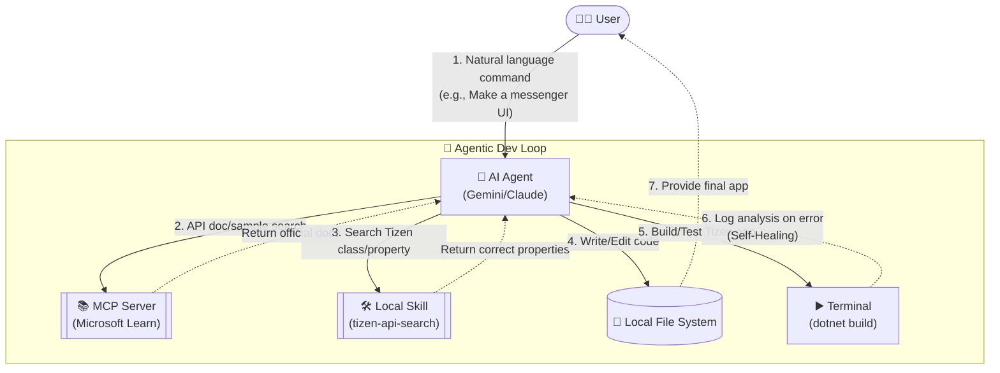

# 🚀 generate-tizen-app

[English](README-en.md) | [한국어](README.md) | [日本語](README-ja.md) | [简体中文](README-zh.md)

An intelligent agent and CLI environment project that automatically generates and builds Tizen .NET UI application code based on natural language requirements using AI.

## 📂 Project Structure

```
generate-tizen-app/
│
├── docs/                          # 📄 Documentation
│   ├── implementation_plan.md     #    Implementation Plan (Master Plan)
│   ├── how_agent_works.md         #    How Interactive Agent Loop Works
│   └── how_cli_works.md           #    How Standalone CLI Generator Works
│
├── scripts/                       # ⚙️ Utility Scripts
│   ├── TizenPackageList.txt       #    List of packages to download
│   ├── Download-TizenPackages.ps1 #    NuGet package downloader (Windows)
│   └── Download-TizenPackages.sh  #    NuGet package downloader (Linux/macOS)
│
├── Packages/                      # 📦 Downloaded NuGet Packages (12 items)
│   ├── Tizen.UI.1.0.0-rc.5/
│   ├── Tizen.UI.Components.1.0.0-rc.5/
│   ├── ... (Total 12 packages)
│   └── nuget.exe
│
├── ApiInfo/                       # 🔍 API Metadata extracted from DLLs
│   ├── Tizen.UI/
│   │   ├── api-index.json         #    Compact JSON (for LLM)
│   │   └── api-summary.md         #    Markdown summary (for human)
│   ├── Tizen.UI.Components/
│   ├── ... (Total 12 packages)
│   └── Tizen.UI.WindowBorder/
│
├── templates/                     # 🧱 Tizen Project Templates (To be built in Phase 2)
│
└── README-en.md                   # This file
```

## ✅ Prerequisites

To run this project and build Tizen apps, the following environment must be set up in advance.

1. Install **Node.js** (v18 or higher recommended)
2. Install **.NET SDK 8.0 or higher**
3. Install **Tizen .NET Workload**
   - If the Tizen workload is not installed on your system, open a terminal (or PowerShell with admin privileges) and run the following command for your OS:
   ```bash
   # Windows (PowerShell)
   powershell -ExecutionPolicy Bypass -File scripts\workload-install.ps1
   
   # Linux / macOS (Bash)
   curl -sSL https://raw.githubusercontent.com/Samsung/Tizen.NET/main/workload/scripts/workload-install.sh | sudo bash
   ```

## 🚀 Usage

This project supports **two powerful ways** to generate Tizen apps depending on your purpose and environment.

### 1. 🤖 Interactive Agent Loop
A method of gradually designing and completing the app through conversation with an AI agent (Gemini, Claude, etc.).

#### Architecture and How It Works
This method goes beyond simple code generation and interacts with various tools to write hallucination-free code.



- **Features**:
  - The agent directly calls `MCP Servers` (Tizen assembly inspection, Microsoft Learn doc integration) and `Local Skills` to craft the code.
  - If a build error occurs, the agent automatically analyzes the cause and corrects the code through a **Self-Healing** process.
  - Suitable for Deep Work such as complex UI/UX design or phased feature additions.
- **How to use**: Open this workspace in an AI Agent environment (e.g., Cursor, VS Code AI extension, Antigravity, etc.) and give instructions in natural language.

### 2. 💻 Standalone CLI Generator
A One-Shot method that instantly generates initial boilerplate code by running a single script line in the terminal without an agent environment.
- **Features**:
  - Great for plugging into automation scripts or CI/CD pipelines.
  - Excellent versatility as you can freely switch LLM providers (Gemini, OpenAI, Claude) according to the situation.
  - Most effective when quickly creating an initial project shell or template rather than detailed debugging.
- **How to use**:

  **Windows (PowerShell)**
  ```powershell
  # Set API key in environment variable (Choose 1)
  $env:GEMINI_API_KEY="your-key"       # Gemini (Default)
  $env:OPENAI_API_KEY="your-key"       # OpenAI
  $env:ANTHROPIC_API_KEY="your-key"    # Claude

  # Generate App
  node scripts/Generate-App.js "Create a calculator app"
  node scripts/Generate-App.js "Video player initial setup screen" --provider openai
  node scripts/Generate-App.js "Todo list app" --provider claude --name TodoApp
  ```

  **Linux / macOS (Bash)**
  ```bash
  # Set API key in environment variable (Choose 1)
  export GEMINI_API_KEY="your-key"       # Gemini (Default)
  export OPENAI_API_KEY="your-key"       # OpenAI
  export ANTHROPIC_API_KEY="your-key"    # Claude

  # Generate App
  node scripts/Generate-App.js "Create a calculator app"
  node scripts/Generate-App.js "Video player initial setup screen" --provider openai
  node scripts/Generate-App.js "Todo list app" --provider claude --name TodoApp
  ```

## 🛠️ Other Usages

### Download Packages

**Windows (PowerShell)**
```powershell
.\scripts\Download-TizenPackages.ps1 -DestinationPath ".\Packages"
```

**Linux / macOS (Bash)**
```bash
chmod +x ./scripts/Download-TizenPackages.sh
./scripts/Download-TizenPackages.sh ./Packages
```

## 📋 Tizen.UI Package List (12 items)

| # | Package | Description |
|---|--------|------|
| 1 | Tizen.UI | Core UI Framework (View, Window, Color, etc.) |
| 2 | Tizen.UI.Layouts | Layout System (HStack, VStack, Grid, FlexBox, etc.) |
| 3 | Tizen.UI.Components | UI Components (Button, Slider, Navigation, etc.) |
| 4 | Tizen.UI.Components.Material | Material Design Components |
| 5 | Tizen.UI.Primitives2D | 2D Basic Shapes |
| 6 | Tizen.UI.Scene3D | 3D Scene Rendering |
| 7 | Tizen.UI.Visuals | Visual Effects |
| 8 | Tizen.UI.Skia | SkiaSharp-based Rendering |
| 9 | Tizen.UI.Tools | Development Tools |
| 10 | Tizen.UI.Widget | Widget Support |
| 11 | Tizen.UI.WindowBorder | Window Border Customization |
| 12 | Tizen.UI.Markdown | Markdown Rendering |
