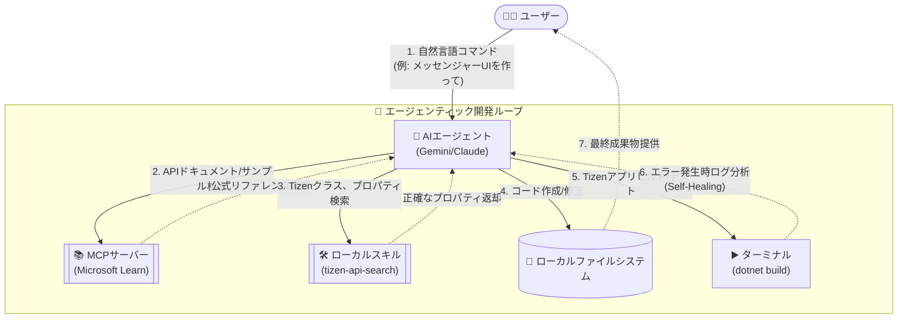

# 🚀 generate-tizen-app

[English](README-en.md) | [한국어](README.md) | [日本語](README-ja.md) | [简体中文](README-zh.md)

AIを活用し、自然言語の要件に基づいてTizen .NET UIアプリケーションコードを自動生成およびビルドする、インテリジェントエージェントおよびCLI環境サポートプロジェクトです。

## 📂 プロジェクト構造

```
generate-tizen-app/
│
├── docs/                          # 📄 ドキュメント
│   ├── implementation_plan.md     #    実装計画書 (マスタープラン)
│   ├── how_agent_works.md         #    エージェント動作原理 (Interactive Agent Loop)
│   └── how_cli_works.md           #    CLI動作原理 (Standalone CLI)
│
├── scripts/                       # ⚙️ ユーティリティスクリプト
│   ├── TizenPackageList.txt       #    ダウンロード対象パッケージ一覧
│   ├── Download-TizenPackages.ps1 #    NuGetパッケージダウンローダ (Windows)
│   └── Download-TizenPackages.sh  #    NuGetパッケージダウンローダ (Linux/macOS)
│
├── Packages/                      # 📦 ダウンロードされたNuGetパッケージ (12個)
│   ├── Tizen.UI.1.0.0-rc.5/
│   ├── Tizen.UI.Components.1.0.0-rc.5/
│   ├── ... (計12パッケージ)
│   └── nuget.exe
│
├── ApiInfo/                       # 🔍 DLLから抽出したAPIメタデータ
│   ├── Tizen.UI/
│   │   ├── api-index.json         #    コンパクトJSON (LLM用)
│   │   └── api-summary.md         #    Markdown要約 (人間用)
│   ├── Tizen.UI.Components/
│   ├── ... (計12パッケージ)
│   └── Tizen.UI.WindowBorder/
│
├── templates/                     # 🧱 Tizenプロジェクトテンプレート (フェーズ2で構築)
│
└── README-ja.md                   # このファイル
```

## ✅ 前提条件 (Prerequisites)

このプロジェクトを実行し、Tizenアプリをビルドするには、以下の環境が事前に準備されている必要があります。

1. **Node.js** のインストール (v18以降を推奨)
2. **.NET SDK 8.0 以降** のインストール
3. **Tizen .NET Workload** のインストール
   - システムにTizen Workloadがない場合は、ターミナル(または管理者権限のPowerShell)を開き、OSに応じた以下のコマンドを実行してインストールできます。
   ```bash
   # Windows (PowerShell)
   powershell -ExecutionPolicy Bypass -File scripts\workload-install.ps1
   
   # Linux / macOS (Bash)
   curl -sSL https://raw.githubusercontent.com/Samsung/Tizen.NET/main/workload/scripts/workload-install.sh | sudo bash
   ```

## 🚀 主な利用方法 (Usage)

このプロジェクトは、ユーザーの目的と環境に合わせて**2つの強力な方法**でTizenアプリを生成できるようにサポートします。

### 1. 🤖 対話型統合エージェントループ (Interactive Agent Loop)
AIエージェント (Gemini, Claudeなど) と対話しながら、段階的にアプリを設計し完成させていく方法です。

#### アーキテクチャおよび動作原理
この作業方式は単なるコード生成を超え、ハルシネーション(幻覚)のないコードを作成するために様々なツールと相互作用します。



- **特徴**:
  - `MCPサーバー` (Tizenアセンブリ検査、Microsoft Learnドキュメント連携) や `ローカルスキル` などをエージェントが直接呼び出してコードを構築します。
  - ビルドエラーが発生した場合、エージェント自らが原因を分析し、コードを修正する **自己修復 (Self-Healing)** のプロセスを経ます。
  - 複雑な UI/UX 設計や段階的な機能追加などのディープワーク (Deep Work) に最適です。
- **使用方法**: AIエージェント環境 (例: Cursor、VS Code AI拡張機能、Antigravityなど) でこのワークスペースを開き、自然言語で指示を出すと即座に動作します。

### 2. 💻 スタンドアロンCLIツール (Standalone CLI Generator)
エージェント環境なしで、ターミナルからスクリプトを1行実行するだけで、初期の定型コード (Boilerplate) を瞬時に生成するワンショット (One-Shot) 方式です。
- **特徴**:
  - 自動化スクリプトや CI/CD パイプラインの部品として組み込むのに優れています。
  - LLMプロバイダー (Gemini、OpenAI、Claude) を状況に合わせて自由に変更できるため、汎用性が高いです。
  - 詳細なデバッグよりも、初期のプロジェクトの枠組みを素早く作成したり、テンプレートを生成したりする際に最も効果的です。
- **使用方法**:

  **Windows (PowerShell)**
  ```powershell
  # 環境変数にAPIキーを設定 (1つを選択)
  $env:GEMINI_API_KEY="your-key"       # Gemini (デフォルト)
  $env:OPENAI_API_KEY="your-key"       # OpenAI
  $env:ANTHROPIC_API_KEY="your-key"    # Claude

  # アプリ生成
  node scripts/Generate-App.js "電卓アプリを作成"
  node scripts/Generate-App.js "動画プレイヤーの初期設定画面" --provider openai
  node scripts/Generate-App.js "ToDoリストアプリ" --provider claude --name TodoApp
  ```

  **Linux / macOS (Bash)**
  ```bash
  # 環境変数にAPIキーを設定 (1つを選択)
  export GEMINI_API_KEY="your-key"       # Gemini (デフォルト)
  export OPENAI_API_KEY="your-key"       # OpenAI
  export ANTHROPIC_API_KEY="your-key"    # Claude

  # アプリ生成
  node scripts/Generate-App.js "電卓アプリを作成"
  node scripts/Generate-App.js "動画プレイヤーの初期設定画面" --provider openai
  node scripts/Generate-App.js "ToDoリストアプリ" --provider claude --name TodoApp
  ```

## 🛠️ その他の使用方法

### パッケージのダウンロード

**Windows (PowerShell)**
```powershell
.\scripts\Download-TizenPackages.ps1 -DestinationPath ".\Packages"
```

**Linux / macOS (Bash)**
```bash
chmod +x ./scripts/Download-TizenPackages.sh
./scripts/Download-TizenPackages.sh ./Packages
```

## 📋 Tizen.UI パッケージ一覧 (12個)

| # | パッケージ | 説明 |
|---|--------|------|
| 1 | Tizen.UI | コアUIフレームワーク (View, Window, Color など) |
| 2 | Tizen.UI.Layouts | レイアウトシステム (HStack, VStack, Grid, FlexBox など) |
| 3 | Tizen.UI.Components | UIコンポーネント (Button, Slider, Navigation など) |
| 4 | Tizen.UI.Components.Material | Material Designコンポーネント |
| 5 | Tizen.UI.Primitives2D | 2D基本図形 |
| 6 | Tizen.UI.Scene3D | 3Dシーンレンダリング |
| 7 | Tizen.UI.Visuals | ビジュアルエフェクト |
| 8 | Tizen.UI.Skia | SkiaSharpベースのレンダリング |
| 9 | Tizen.UI.Tools | 開発ツール |
| 10 | Tizen.UI.Widget | ウィジェットサポート |
| 11 | Tizen.UI.WindowBorder | ウィンドウ境界線のカスタマイズ |
| 12 | Tizen.UI.Markdown | Markdownレンダリング |
