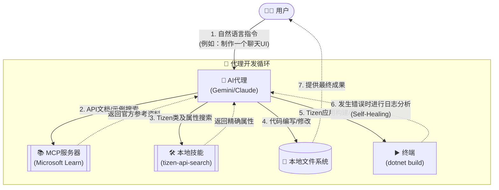

# 🚀 generate-tizen-app

[English](README-en.md) | [한국어](README.md) | [日本語](README-ja.md) | [简体中文](README-zh.md)

一个智能代理及CLI环境支持项目，利用AI根据自然语言需求自动生成并构建Tizen .NET UI应用程序代码。

## 📂 项目结构

```
generate-tizen-app/
│
├── docs/                          # 📄 文档
│   ├── implementation_plan.md     #    实施计划 (Master Plan)
│   ├── how_agent_works.md         #    代理工作原理 (Interactive Agent Loop)
│   └── how_cli_works.md           #    CLI工作原理 (Standalone CLI)
│
├── scripts/                       # ⚙️ 实用脚本
│   ├── TizenPackageList.txt       #    需要下载的包列表
│   ├── Download-TizenPackages.ps1 #    NuGet包下载器 (Windows)
│   └── Download-TizenPackages.sh  #    NuGet包下载器 (Linux/macOS)
│
├── Packages/                      # 📦 下载的NuGet包 (12个)
│   ├── Tizen.UI.1.0.0-rc.5/
│   ├── Tizen.UI.Components.1.0.0-rc.5/
│   ├── ... (共12个包)
│   └── nuget.exe
│
├── ApiInfo/                       # 🔍 从DLL提取的API元数据
│   ├── Tizen.UI/
│   │   ├── api-index.json         #    紧凑的JSON格式 (供LLM使用)
│   │   └── api-summary.md         #    Markdown摘要 (供人类阅读)
│   ├── Tizen.UI.Components/
│   ├── ... (共12个包)
│   └── Tizen.UI.WindowBorder/
│
├── templates/                     # 🧱 Tizen项目模板 (将在第二阶段构建)
│
└── README-zh.md                   # 该文件
```

## ✅ 必备条件 (Prerequisites)

为了运行该项目并构建Tizen应用，必须提前准备好以下环境：

1. 安装 **Node.js** (推荐 v18 及以上)
2. 安装 **.NET SDK 8.0 及以上**
3. 安装 **Tizen .NET Workload**
   - 如果您的系统上没有Tizen workload，可以打开终端（或以管理员权限运行PowerShell），根据您的系统环境运行以下命令即可完成安装：
   ```bash
   # Windows (PowerShell)
   powershell -ExecutionPolicy Bypass -File scripts\workload-install.ps1
   
   # Linux / macOS (Bash)
   curl -sSL https://raw.githubusercontent.com/Samsung/Tizen.NET/main/workload/scripts/workload-install.sh | sudo bash
   ```

## 🚀 主要使用方式 (Usage)

本项目根据您的目的与环境，支持以**两种强大的方式**生成Tizen应用。

### 1. 🤖 交互式集成代理循环 (Interactive Agent Loop)
这是一种通过与AI代理（Gemini, Claude等）进行对话，逐步设计并完善应用的开发方式。

#### 架构及工作原理
这种工作方式不仅限于简单的代码生成，而是通过与各种工具交互来编写无幻觉（Hallucination-free）的代码。



- **特点**:
  - 代理会直接调用`MCP服务器`（Tizen程序集检查、Microsoft Learn文档联动）以及`本地技能`等，亲自编写并打磨代码。
  - 当发生构建错误时，代理会自动分析原因，并通过**自我修复（Self-Healing）**过程对代码进行更正。
  - 非常适合用于复杂的UI/UX设计或分段式功能添加等深度工作（Deep Work）。
- **使用方法**: 在AI代理环境（例如 Cursor, VS Code AI扩展, Antigravity等）中打开此工作区，然后用自然语言下达指令即可立即运行。

### 2. 💻 独立CLI生成器 (Standalone CLI Generator)
这是一种“一键式（One-Shot）”方法，无需代理环境，只需在终端运行一行脚本，即可瞬间生成初始样板代码（Boilerplate）。
- **特点**:
  - 非常适合作为自动化脚本或CI/CD流水线的组件使用。
  - 能够根据实际情况自由切换LLM提供商（Gemini, OpenAI, Claude），具有极强的通用性。
  - 相比于精细的调试工作，它在快速搭建项目外壳或生成模板时最为高效。
- **使用方法**:

  **Windows (PowerShell)**
  ```powershell
  # 在环境变量中设置API密钥（选择一种）
  $env:GEMINI_API_KEY="your-key"       # Gemini (默认)
  $env:OPENAI_API_KEY="your-key"       # OpenAI
  $env:ANTHROPIC_API_KEY="your-key"    # Claude

  # 生成应用
  node scripts/Generate-App.js "创建一个计算器应用"
  node scripts/Generate-App.js "视频播放器初始化设置画面" --provider openai
  node scripts/Generate-App.js "待办事项应用" --provider claude --name TodoApp
  ```

  **Linux / macOS (Bash)**
  ```bash
  # 在环境变量中设置API密钥（选择一种）
  export GEMINI_API_KEY="your-key"       # Gemini (默认)
  export OPENAI_API_KEY="your-key"       # OpenAI
  export ANTHROPIC_API_KEY="your-key"    # Claude

  # 生成应用
  node scripts/Generate-App.js "创建一个计算器应用"
  node scripts/Generate-App.js "视频播放器初始化设置画面" --provider openai
  node scripts/Generate-App.js "待办事项应用" --provider claude --name TodoApp
  ```

## 🛠️ 其他用法

### 包下载

**Windows (PowerShell)**
```powershell
.\scripts\Download-TizenPackages.ps1 -DestinationPath ".\Packages"
```

**Linux / macOS (Bash)**
```bash
chmod +x ./scripts/Download-TizenPackages.sh
./scripts/Download-TizenPackages.sh ./Packages
```

## 📋 Tizen.UI 包列表 (共12个)

| # | 包名称 | 描述 |
|---|--------|------|
| 1 | Tizen.UI | 核心UI框架 (View, Window, Color 等) |
| 2 | Tizen.UI.Layouts | 布局系统 (HStack, VStack, Grid, FlexBox 等) |
| 3 | Tizen.UI.Components | UI组件 (Button, Slider, Navigation 等) |
| 4 | Tizen.UI.Components.Material | 材质设计(Material Design)组件 |
| 5 | Tizen.UI.Primitives2D | 2D基本形状 |
| 6 | Tizen.UI.Scene3D | 3D场景渲染 |
| 7 | Tizen.UI.Visuals | 视觉特效 |
| 8 | Tizen.UI.Skia | 基于SkiaSharp的渲染 |
| 9 | Tizen.UI.Tools | 开发工具 |
| 10 | Tizen.UI.Widget | 小组件(Widget)支持 |
| 11 | Tizen.UI.WindowBorder | 窗口边框自定义 |
| 12 | Tizen.UI.Markdown | Markdown渲染 |
