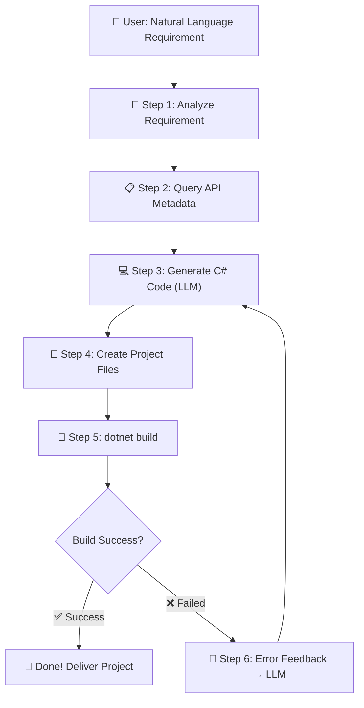

# 🚀 Tizen .NET UI App Generation Agent - Implementation Plan

[English](implementation_plan-en.md) | [한국어](implementation_plan.md) | [日本語](implementation_plan-ja.md) | [简体中文](implementation_plan-zh.md)

> **Project Codename**: generate-tizen-app
> **Author**: Tizen UI Generation Agent
> **Date**: 2026-03-07
> **Requirement**: "Develop an agentic loop that automatically generates a .NET UI app based on natural language descriptions."

---

## 📊 Currently Acquired Assets

| Asset | Path | Description |
|------|------|------|
| Package List | `TizenPackageList.txt` | Names of 12 Tizen.UI packages |
| Download Script | `Download-TizenPackages.ps1` | Cleanly downloads packages from NuGet |
| Package Files | `Packages/` | 12 `.nupkg` files + original DLLs |
| API Metadata | `ApiInfo/` | `api-index.json` + `api-summary.md` of 12 packages |
| Assembly Inspector | `dotnet-assembly-inspector` | Tool to convert DLL → JSON/MD (MCP Server) |

---

## 🏗️ Overall Architecture (Agentic Dev Loop)



---

## 📝 Step-by-Step Implementation Plan

### Phase 1: Build API Knowledge Base ✅ Completed
> **Goal**: Enable LLM to "pretend to know" Tizen.UI

#### 1-1. Compile API Summaries
- [x] Finished downloading 12 package DLLs
- [x] Extracted `api-index.json` + `api-summary.md` via `dotnet-assembly-inspector`
- [x] Created **Core Control Catalog** (Lightweight version for LLM prompt injection)
  - The full `api-summary.md` is too large (Tizen.UI alone is 6600 lines, Tizen.UI.Components is 4200 lines)
  - Need a **lightweight catalog** extracting only "Name / Main Properties / Main Events" per UI control
  - Example: `Button → Text, TextColor, BackgroundColor, Clicked Event`

#### 1-2. Automate Control Catalog Generation Script
- [x] Parse `api-index.json` to filter only classes inheriting from `View`
- [x] Extract public properties and events for each class
- [x] Save results as `TizenUI_ControlCatalog.json` (or `.md`)
- [x] This file serves as the **system context** in the LLM prompt

---

### Phase 2: Prepare Project Templates ✅ Completed
> **Goal**: Tizen project boilerplate to immediately build AI-generated code

#### 2-1. Generate Tizen .NET Project Template
- [x] `.csproj` file (targeting net8.0-tizen10.0)
- [x] `tizen-manifest.xml` (app manifest)
- [x] `MainView.cs` (Core view with Scaffold structure for AI code insertion)
- [x] `App.cs` (Entry point - MaterialApplication calling MainView)
- [x] NuGet package references (optimized with required core packages)
- [x] Template stored in `templates/` folder

#### 2-2. Template Variable System
- [x] Define placeholders like `{{APP_NAME}}`, `{{MAIN_VIEW_CONTENT}}`
- [x] Create `Create-TizenProject.js` to assemble projects by substituting placeholders

---

### Phase 3~5: Automatic Integrated Agent Loop (AI Workflow) ✅ Completed
> **Goal**: Integrate the entire process of Natural Language → C# Code Conversion → Project Build → Self-Healing **into a single Agent workflow**

#### 3~5 Integration: Created `.agent/workflows/generate-tizen-app.md`
- Targeting agent single-pipeline processing, elevated beyond scripts to an internal workflow file for the AI agent
- Through a single command execution (`/generate-tizen-app` or prompt request), the entire process runs automatically in an unattended environment:
  1. Combine `ApiInfo/TizenUI_ControlCatalog.md` contents with built-in C# knowledge
  2. Generate project boilerplate with `Create-TizenProject.js`
  3. Replace/generate `MainView.cs` (`write_to_file`)
  4. Run `dotnet build` and retry up to 3 times on error (Self-Healing)

---

### Phase 6: Standalone CLI Tool (Available for Everyone) ✅ Completed
> **Goal**: Implement a tool allowing users to automatically generate Tizen apps in a CLI environment without needing an agent instance.

#### 6-1. LLM Provider Abstraction (`scripts/llm-providers.js`)
- [x] Multi-provider support: **Gemini**(Default), OpenAI, Claude
- [x] Manage API keys via environment variables (`GEMINI_API_KEY`, `OPENAI_API_KEY`, `ANTHROPIC_API_KEY`)
- [x] Common interface: `generateCode(systemPrompt, userPrompt) → string`

#### 6-2. System Prompt Template (`prompts/system-prompt.md`)
- [x] Define role as a professional Tizen.UI developer
- [x] Auto-insert control catalog (`{{CONTROL_CATALOG}}`)
- [x] Code output rules (Scaffold Root, Fluent API, MaterialApplication, etc.)

#### 6-3. App Generation CLI (`scripts/Generate-App.js`)
- [x] Usage: `node scripts/Generate-App.js "Calculator app" --provider gemini`
- [x] Natural Language → LLM API Call → Extract C# Code → Assemble Project → Auto Build
- [x] Built-in Self-Healing (Recalls LLM up to 3 times strictly upon build error)

---

## 🗓️ Implementation Priority (Recommended Order)

| Order | Phase | Core Deliverable | Status |
|------|-------|------------|------|
| 1️⃣ | Phase 1 | Control Catalog Lightweight JSON | ✅ Completed |
| 2️⃣ | Phase 2 | Project Templates | ✅ Completed |
| 3️⃣ | Phase 3~5 | Agent Workflow | ✅ Completed |
| 4️⃣ | Phase 6 | Standalone CLI Tool (Multi-LLM) | ✅ Completed |

---

## ✅ Key Architectural Decisions (Finalized 2026-03-07)

| Item | Decision |
|------|------|
| **LLM Execution Body** | Processed based on AI Agent single pipeline |
| **Operation Method** | Workflow integration (minimize external scripts and parallel CLI operations) |
| **Build Environment** | Requires Tizen workload installation (using `workload-install.ps1`) |
| **Code Style** | C# Fluent API based UI |

### Tizen Workload Installation Guide
- Ref: https://github.com/Samsung/Tizen.NET/wiki/Installing-Tizen-.NET-Workload#install-tizen-net-workload-2

**Windows:**
```powershell
Invoke-WebRequest 'https://raw.githubusercontent.com/Samsung/Tizen.NET/main/workload/scripts/workload-install.ps1' -OutFile 'workload-install.ps1';
./workload-install.ps1 [-v <version>] [-d <directory>]
```

**Linux / macOS:**
```bash
curl -sSL https://raw.githubusercontent.com/Samsung/Tizen.NET/main/workload/scripts/workload-install.sh | sudo bash
```

---

## 🔧 Utilized Tools and MCP Servers

| Tool | Purpose | Status |
|------|------|------|
| `dotnet-assembly-inspector` (MCP) | DLL → Extract API metadata | ✅ Utilized |
| **Microsoft Learn MCP** | Real-time search of official .NET/C# docs (prevents hallucination) | 📌 Scheduled |

> **Microsoft Learn MCP Server** (`https://learn.microsoft.com/api/mcp`)
> - Requires no authentication (Free)
> - Provided Tools: `microsoft_docs_search`, `microsoft_docs_fetch`, `microsoft_code_sample_search`
> - Tizen.UI is not covered, but helps prevent hallucination for C# standard libraries/patterns inquiries
