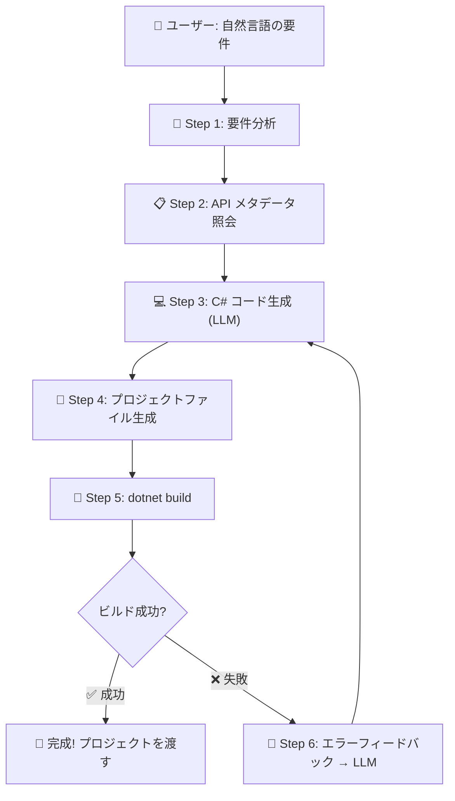

# 🚀 Tizen .NET UI アプリ自動生成エージェント - 実装計画書

[English](implementation_plan-en.md) | [한국어](implementation_plan.md) | [日本語](implementation_plan-ja.md) | [简体中文](implementation_plan-zh.md)

> **プロジェクトコードネーム**: generate-tizen-app
> **作成者**: Tizen UI Generation Agent
> **日付**: 2026-03-07
> **要件**: "自然言語で説明すれば、対応する .NET UI アプリを自動生成するエージェント開発ループの構築"

---

## 📊 現在確保された資産

| 資産 | パス | 説明 |
|------|------|------|
| パッケージ一覧 | `TizenPackageList.txt` | 12個の Tizen.UI パッケージ名 |
| ダウンロードスクリプト | `Download-TizenPackages.ps1` | NuGetからのパッケージのダウンロード |
| パッケージファイル | `Packages/` | 12個の `.nupkg` + DLL 原本 |
| APIメタデータ | `ApiInfo/` | 12パッケージの `api-index.json` + `api-summary.md` |
| アセンブリインスペクタ | `dotnet-assembly-inspector` | DLL → JSON/MD 変換ツール (MCP サーバー) |

---

## 🏗️ 全体アーキテクチャ (Agentic Dev Loop)



---

## 📝 段階別の詳細な実装計画

### Phase 1: API ナレッジベースの構築 (Knowledge Base) ✅ 完了
> **目標**: LLMがTizen.UIを「知っているふり」ができるようにする

#### 1-1. API 要約の整理
- [x] 12個のパッケージDLLのダウンロード完了
- [x] `dotnet-assembly-inspector`で `api-index.json` + `api-summary.md` 抽出完了
- [x] **コアコントロールカタログ** 生成（LLMプロンプトに注入する軽量化バージョン）
  - 全体の `api-summary.md` は巨大すぎる（Tizen.UIだけで6600行、Tizen.UI.Componentsは4200行）
  - UI コントロールごとの「名前 / 主要プロパティ / 主要イベント」のみを抽出した**軽量カタログ**が必要
  - 例：`Button → Text, TextColor, BackgroundColor, Clicked イベント`

#### 1-2. コントロールカタログ自動生成スクリプト
- [x] `api-index.json` をパースし、`View` を継承するクラスのみをフィルタリング
- [x] 各クラスのパブリックプロパティとイベントを抽出
- [x] 結果を `TizenUI_ControlCatalog.json` (または `.md`) として保存
- [x] このファイルが LLM プロンプトの**システムコンテキスト**に組み込まれる

---

### Phase 2: プロジェクトテンプレートの準備 ✅ 完了
> **目標**: AIが生成したコードをすぐにビルドできる Tizen プロジェクトの骨組み

#### 2-1. Tizen .NET プロジェクトテンプレートの生成
- [x] `.csproj` ファイル (net8.0-tizen10.0 ターゲット)
- [x] `tizen-manifest.xml` (アプリマニフェスト)
- [x] `MainView.cs` (AIコードを挿入する Scaffold 構造のコア View)
- [x] `App.cs` (エントリポイント - MainView を呼び出す MaterialApplication)
- [x] NuGet パッケージ参照 (必要なコアパッケージで最適化)
- [x] このテンプレートは `templates/` フォルダに保管

#### 2-2. テンプレート変数システム
- [x] `{{APP_NAME}}`、`{{MAIN_VIEW_CONTENT}}` などのプレースホルダーを定義
- [x] プレースホルダーを置換してプロジェクトを組み立てる `Create-TizenProject.js` を作成

---

### Phase 3~5: 自動統合エージェントループ (AI Workflow) ✅ 完了
> **目標**: 自然言語 → C# コード変換 → プロジェクトのビルド → 自己修復(Self-Healing) の全過程を**単一の Agent ワークフローとして統合実行**

#### 3~5 統合: `.agent/workflows/generate-tizen-app.md` 作成完了
- エージェントの単一パイプライン処理を目標に、スクリプトベースの枠を超え AL エージェントの内部ワークフローファイルへ昇華
- コマンド単一実行 (`/generate-tizen-app` またはプロンプト要求) により、全体プロセスを無人環境で自動実行：
  1. `ApiInfo/TizenUI_ControlCatalog.md` の内容と内蔵の C# 知識を結合
  2. `Create-TizenProject.js` でプロジェクトの骨組みを生成
  3. `MainView.cs` の置換生成 (`write_to_file`)
  4. `dotnet build` を実行し、エラー検出時に最大 3 回の再挑戦 (Self-Healing)

---

### Phase 6: スタンドアロンCLIツール (誰でも利用可能) ✅ 完了
> **目標**: エージェントインスタンスがなくても、ユーザーがCLI環境で Tizen アプリを自動生成できるツールを実装

#### 6-1. LLM プロバイダーの抽象化 (`scripts/llm-providers.js`)
- [x] マルチプロバイダーサポート: **Gemini**(デフォルト), OpenAI, Claude
- [x] 環境変数での API キー管理 (`GEMINI_API_KEY`, `OPENAI_API_KEY`, `ANTHROPIC_API_KEY`)
- [x] 共通インターフェース: `generateCode(systemPrompt, userPrompt) → string`

#### 6-2. システムプロンプトテンプレート (`prompts/system-prompt.md`)
- [x] Tizen.UI 専門開発者の役割を定義
- [x] コントロールカタログの自動挿入 (`{{CONTROL_CATALOG}}`)
- [x] コード出力規則 (Scaffold Root, Fluent API, MaterialApplication など)

#### 6-3. アプリ生成 CLI (`scripts/Generate-App.js`)
- [x] 使用方法: `node scripts/Generate-App.js "電卓アプリ" --provider gemini`
- [x] 自然言語 → LLM API 呼び出し → C# コードの抽出 → プロジェクト組み立て → 自動ビルド
- [x] Self-Healing 内蔵 (ビルドエラー時に最大 3 回まで LLM を再呼び出し)

---

## 🗓️ 実装優先順位 (推奨順)

| 順序 | Phase | コア成果物 | 状態 |
|------|-------|------------|------|
| 1️⃣ | Phase 1 | コントロールカタログ 軽量JSON | ✅ 完了 |
| 2️⃣ | Phase 2 | プロジェクトテンプレート | ✅ 完了 |
| 3️⃣ | Phase 3~5 | エージェントワークフロー | ✅ 完了 |
| 4️⃣ | Phase 6 | スタンドアロンCLIツール (マルチLLM) | ✅ 完了 |

---

## ✅ 主要なアーキテクチャの決定事項 (2026-03-07 確定)

| 項目 | 決定事項 |
|------|------|
| **LLM 実行主体** | AIエージェントの単一パイプラインに基づく処理 |
| **運用方式** | ワークフローとの統合 (外部スクリプトの最小化およびCLIとの並行運用) |
| **ビルド環境** | Tizen workload のインストール要 (`workload-install.ps1` を使用) |
| **コードスタイル** | C# Fluent API に基づく UI |

### Tizen Workload のインストール方法
- 参考: https://github.com/Samsung/Tizen.NET/wiki/Installing-Tizen-.NET-Workload#install-tizen-net-workload-2

**Windows:**
```powershell
Invoke-WebRequest 'https://raw.githubusercontent.com/Samsung/Tizen.NET/main/workload/scripts/workload-install.ps1' -OutFile 'workload-install.ps1';
./workload-install.ps1 [-v <version>] [-d <directory>]
```

**Linux / macOS:**
```bash
curl -sSL https://raw.githubusercontent.com/Samsung/Tizen.NET/main/workload/scripts/workload-install.sh | sudo bash
```

---

## 🔧 活用ツールおよびMCP サーバー

| ツール | 目的 | 状態 |
|------|------|------|
| `dotnet-assembly-inspector` (MCP) | DLL → API メタデータの抽出 | ✅ 活用完了 |
| **Microsoft Learn MCP** | .NET/C# 公式ドキュメントのリアルタイム検索 (幻覚防止) | 📌 登録予定 |

> **Microsoft Learn MCP サーバー** (`https://learn.microsoft.com/api/mcp`)
> - 認証不要 (無料)
> - 提供ツール: `microsoft_docs_search`, `microsoft_docs_fetch`, `microsoft_code_sample_search`
> - Tizen.UI はカバーしていませんが、C# 標準ライブラリ/パターンの質問時に幻覚（Hallucination）の防止に役立ちます
