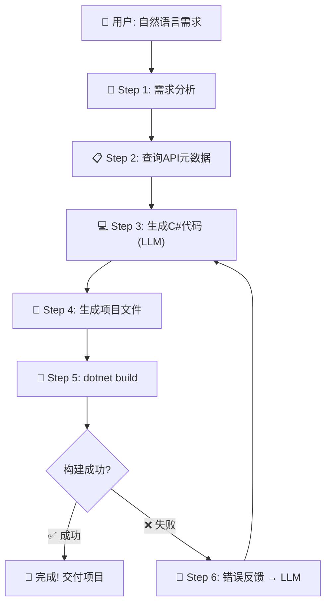

# 🚀 Tizen .NET UI 应用自动生成代理 - 实施计划

[English](implementation_plan-en.md) | [한국어](implementation_plan.md) | [日本語](implementation_plan-ja.md) | [简体中文](implementation_plan-zh.md)

> **项目代号**: generate-tizen-app
> **撰写方**: Tizen UI Generation Agent
> **日期**: 2026-03-07
> **需求**: "建立一个只要用自然语言描述，即可自动生成相应的 .NET UI 应用程序的代理开发循环"

---

## 📊 当前保障资产

| 资产 | 路径 | 描述 |
|------|------|------|
| 包列表 | `TizenPackageList.txt` | 12个 Tizen.UI 包的名称 |
| 下载脚本 | `Download-TizenPackages.ps1` | 从NuGet纯净下载包 |
| 文件包 | `Packages/` | 12个 `.nupkg` + 原DLL |
| API元数据 | `ApiInfo/` | 12个包的 `api-index.json` + `api-summary.md` |
| 程序集检查器 | `dotnet-assembly-inspector` | 把DLL → JSON/MD转换工具 (MCP 服务器) |

---

## 🏗️ 整体架构 (Agentic Dev Loop)



---

## 📝 分步详细实施计划

### Phase 1: 构建API知识库 (Knowledge Base) ✅ 完成
> **目标**: 让LLM“假装”懂Tizen.UI

#### 1-1. 整理API摘要
- [x] 下载完成12个包DLL
- [x] 通过 `dotnet-assembly-inspector` 提取 `api-index.json` + `api-summary.md` 完成
- [x] 生成 **核心控件目录** (用于注入到LLM提示词中的轻量级版本)
  - 完整的 `api-summary.md` 过于庞大（光 Tizen.UI 就 6600 行、Tizen.UI.Components 有 4200 行）
  - 需要提取每个UI控件的“名称 / 主要属性 / 主要事件” 构成 **轻量级目录**
  - 例：`Button → Text, TextColor, BackgroundColor, Clicked 事件`

#### 1-2. 控件目录自动生成脚本
- [x] 解析 `api-index.json`，仅过滤出继承自 `View` 的类
- [x] 提取每个类的 public 属性及事件
- [x] 将结果另存为 `TizenUI_ControlCatalog.json` (或 `.md`)
- [x] 将该文件注入作为LLM提示词的**系统上下文**

---

### Phase 2: 准备项目模板 ✅ 完成
> **目标**: 搭建能够立即编译AI生成代码的 Tizen 项目骨架。

#### 2-1. 生成 Tizen .NET 项目模板
- [x] `.csproj` 文件 (目标设为 net8.0-tizen10.0)
- [x] `tizen-manifest.xml` (应用清单)
- [x] `MainView.cs` (用于插入AI代码并带Scaffold结构的核心视图)
- [x] `App.cs` (程序的入口 - 调用MainView的MaterialApplication)
- [x] NuGet包引用 (利用必需核心包进行了优化)
- [x] 该模板留存在 `templates/` 文件夹内

#### 2-2. 模板变量系统
- [x] 定义 `{{APP_NAME}}`、`{{MAIN_VIEW_CONTENT}}` 等占位符
- [x] 开发 `Create-TizenProject.js` 实现占位符替换来组装项目

---

### Phase 3~5: 自动化集成代理循环 (AI Workflow) ✅ 完成
> **目标**: 将自然语言 → 转C#代码 → 编译项目 → 自我修补错误(Self-Healing)的全过程**统一融合进单个代理的工作流中执行**

#### 3~5 整合: 编写完成 `.agent/workflows/generate-tizen-app.md`
- 致力于代理单流水线处理模式，超越仅基于脚本的阶段，升华为AI代理的内部工作流文件
- 通过运行单条命令（`/generate-tizen-app` 或依据提示请求），于无人值守环境下自动完成整套流程：
  1. 结合 `ApiInfo/TizenUI_ControlCatalog.md` 的内容与内建C#知识
  2. 使用 `Create-TizenProject.js` 生成项目骨架
  3. 替换生成 `MainView.cs` (`write_to_file`)
  4. 运行 `dotnet build` 后，对于被检测到的错误允许最多3次的重新挑战 (Self-Healing)

---

### Phase 6: 独立 CLI 工具 (任何人均可使用) ✅ 完成
> **目标**: 使无代理实例环境的用户，亦可通过CLI环境自动生成Tizen应用的实用工具。

#### 6-1. 抽象化 LLM 提供商 (`scripts/llm-providers.js`)
- [x] 多提供商支持: **Gemini**(默认), OpenAI, Claude
- [x] 通过环境变量管理API Key (`GEMINI_API_KEY`, `OPENAI_API_KEY`, `ANTHROPIC_API_KEY`)
- [x] 接口统一: `generateCode(systemPrompt, userPrompt) → string`

#### 6-2. 系统提示词模板 (`prompts/system-prompt.md`)
- [x] 将角色定义为专职 Tizen.UI 开发人员
- [x] 控件目录自动插入 (`{{CONTROL_CATALOG}}`)
- [x] 代码输出准则 (Scaffold 根视图、Fluent API书写方式, MaterialApplication 等)

#### 6-3. 应用生成 CLI (`scripts/Generate-App.js`)
- [x] 用法与示例: `node scripts/Generate-App.js "计算器应用" --provider gemini`
- [x] 过程：自然语言 → LLM API调用 → 扒取生成的C#代码 → 拼装对应项目 → 进行自动构建
- [x] 内嵌Self-Healing (只要构建错误未解决，将最多重新调用LLM达3次)

---

## 🗓️ 实施优先级 (推荐顺序)

| 顺序 | 阶段 | 核心交付物 | 状态 |
|------|-------|------------|------|
| 1️⃣ | Phase 1 | 控件目录 轻量JSON文件 | ✅ 完成 |
| 2️⃣ | Phase 2 | 备妥项目模板 | ✅ 完成 |
| 3️⃣ | Phase 3~5 | 梳理代理工作流 | ✅ 完成 |
| 4️⃣ | Phase 6 | 独立CLI 工具 (多 LLM支持) | ✅ 完成 |

---

## ✅ 重点架构决策事项 (结稿于: 2026-03-07)

| 事项 | 决定内容 |
|------|------|
| **主导LLM执行者** | 遵循 AI 代理单流水线模式办理 |
| **运营方式** | 集成于工作流之下 (尽量避免外部脚本并与 CLI 方案并存运营) |
| **构建环境保障** | 必须安装 Tizen workload (利用 `workload-install.ps1` 进行) |
| **代码格式风格** | 基于 C# Fluent API 语法书写 UI 页面 |

### 安装 Tizen Workload 的方法
- 参见: https://github.com/Samsung/Tizen.NET/wiki/Installing-Tizen-.NET-Workload#install-tizen-net-workload-2

**Windows（操作系统系下）:**
```powershell
Invoke-WebRequest 'https://raw.githubusercontent.com/Samsung/Tizen.NET/main/workload/scripts/workload-install.ps1' -OutFile 'workload-install.ps1';
./workload-install.ps1 [-v <version>] [-d <directory>]
```

**Linux / macOS:**
```bash
curl -sSL https://raw.githubusercontent.com/Samsung/Tizen.NET/main/workload/scripts/workload-install.sh | sudo bash
```

---

## 🔧 引用的工具 及 MCP 服务器

| 工具 | 对应效用 | 状态 |
|------|------|------|
| `dotnet-assembly-inspector` (MCP) | DLL → 负责提取 API 规范元数据 | ✅ 已能利用 |
| **Microsoft Learn MCP** | 实时搜索 .NET/C# 官方文档 (防范出现幻觉) | 📌 计划挂载 |

> **Microsoft Learn MCP 服务器** (`https://learn.microsoft.com/api/mcp`)
> - 步骤无需任何认证凭据 (且永久免费)
> - 赋予的工具: `microsoft_docs_search`, `microsoft_docs_fetch`, `microsoft_code_sample_search`
> - 虽然未明确涵盖 Tizen.UI 的所有专属内容，但在追查 C# 标准函数库/常用设计模式提问时，仍旧极其有助于防患未然的屏蔽幻觉现象 (Hallucination)。
