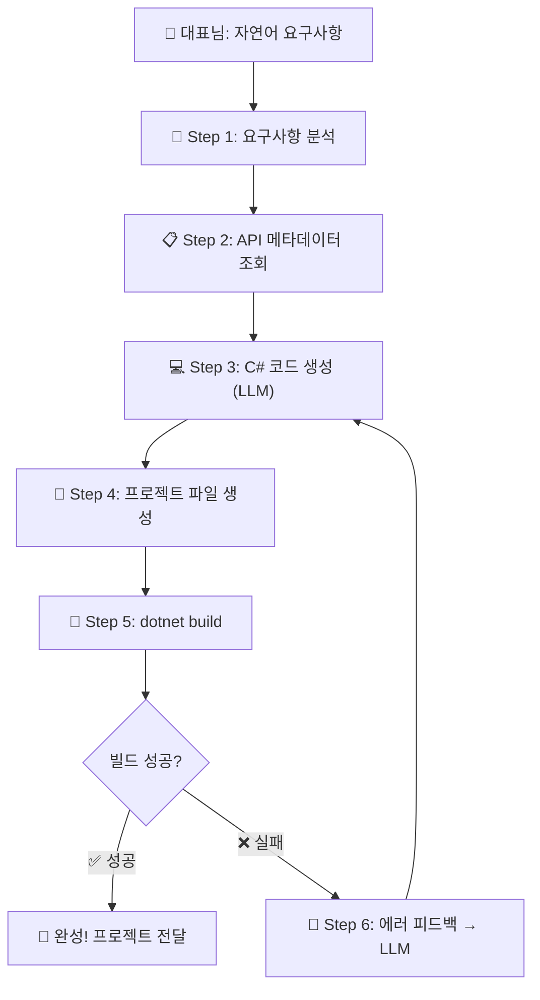

# 🚀 Tizen .NET UI 앱 자동 생성 에이전트 - 구현 계획서

> **프로젝트 코드명**: Generate_TizenApp
> **작성**: 개발팀장 호딱 🫡
> **작성일**: 2026-03-07
> **대표님 요구사항**: "내가 말하면 그거에 해당하는 .NET UI 앱을 자동으로 생성해주는 에이전트 개발 루프"

---

## 📊 현재 확보된 자산

| 자산 | 경로 | 설명 |
|------|------|------|
| 패키지 목록 | `TizenPackageList.txt` | 12개 Tizen.UI 패키지 이름 |
| 다운로드 스크립트 | `Download-TizenPackages.ps1` | NuGet에서 패키지만 깔끔하게 다운로드 |
| 패키지 파일 | `Packages/` | 12개 `.nupkg` + DLL 원본 |
| API 메타데이터 | `ApiInfo/` | 12개 패키지의 `api-index.json` + `api-summary.md` |
| 어셈블리 인스펙터 | `dotnet-assembly-inspector` | DLL → JSON/MD 변환 도구 (MCP 서버) |

---

## 🏗️ 전체 아키텍처 (Agentic Dev Loop)



---

## 📝 단계별 상세 구현 계획

### Phase 1: API 지식 베이스 구축 (Knowledge Base) ✅ 완료
> **목표**: LLM이 Tizen.UI를 "아는 척"할 수 있게 만들기

#### 1-1. API 요약본 정리
- [x] 12개 패키지 DLL 다운로드 완료
- [x] `dotnet-assembly-inspector`로 `api-index.json` + `api-summary.md` 추출 완료
- [x] **핵심 컨트롤 카탈로그** 생성 (LLM 프롬프트에 주입할 경량 버전)
  - 전체 `api-summary.md`는 너무 거대 (Tizen.UI만 6600줄, Tizen.UI.Components 4200줄)
  - UI 컨트롤별 "이름 / 주요 속성 / 주요 이벤트"만 뽑은 **경량 카탈로그** 필요
  - 예: `Button → Text, TextColor, BackgroundColor, Clicked 이벤트`

#### 1-2. 컨트롤 카탈로그 자동 생성 스크립트
- [x] `api-index.json`을 파싱해서 `View`를 상속하는 클래스만 필터링
- [x] 각 클래스의 public 프로퍼티와 이벤트만 추출
- [x] 결과를 `TizenUI_ControlCatalog.json` (또는 `.md`)로 저장
- [x] 이 파일이 LLM 프롬프트의 **시스템 컨텍스트**로 들어감

---

### Phase 2: 프로젝트 템플릿 준비 ✅ 완료
> **목표**: AI가 생성한 코드를 바로 빌드할 수 있는 Tizen 프로젝트 뼈대

#### 2-1. Tizen .NET 프로젝트 템플릿 생성
- [x] `.csproj` 파일 (net8.0-tizen10.0 타겟)
- [x] `tizen-manifest.xml` (앱 매니페스트)
- [x] `MainView.cs` (AI 코드를 삽입할 Scaffold 구조의 핵심 View)
- [x] `App.cs` (엔트리 포인트 - MainView를 호출하는 MaterialApplication)
- [x] NuGet 패키지 참조 (필요한 핵심 패키지로 최적화)
- [x] 이 템플릿은 `templates/` 폴더에 보관

#### 2-2. 템플릿 변수 시스템
- [x] `{{APP_NAME}}`, `{{MAIN_VIEW_CONTENT}}` 등 플레이스홀더 정의
- [x] 플레이스홀더를 치환하여 프로젝트를 조립하는 `Create-TizenProject.js` 생성

---

### Phase 3: 코드 생성 엔진 (LLM 연동)
> **목표**: 자연어 → Tizen C# 코드 변환

#### 3-1. 시스템 프롬프트 설계
- **역할 정의**: "Tizen .NET UI 전문 개발자"
- **입력**: 컨트롤 카탈로그(Phase 1) + 사용자 요구사항
- **출력 형식**: 순수 C# 코드 (JSON 래핑)
- **규칙**: 
  - Tizen.UI 네임스페이스만 사용
  - XAML 없음 (코드 기반 UI)
  - View, ViewGroup 기반 계층구조
  - Tizen.UI.Layouts의 레이아웃 시스템 활용 (HStack, VStack, Grid 등)

#### 3-2. 프롬프트 템플릿 파일
```
You are a Tizen .NET UI expert.
Available controls: {{CONTROL_CATALOG}}
User request: {{USER_REQUEST}}
Generate C# code for MainView class...
```

#### 3-3. LLM API 연동
- Gemini API 또는 다른 LLM API 사용
- API 키 관리 (환경변수)
- 응답 파싱 (코드 블록 추출)

---

### Phase 4: 빌드 및 실행 엔진
> **목표**: 생성된 코드를 자동으로 빌드

#### 4-1. 프로젝트 조립 스크립트
- 템플릿(Phase 2) + 생성된 코드(Phase 3)를 합쳐 실제 프로젝트 생성
- 출력 폴더: `Output/{앱이름}/`

#### 4-2. 자동 빌드
- `dotnet build` 실행
- 빌드 로그 캡처
- 성공/실패 판별

---

### Phase 5: 에러 피드백 루프 (Self-Healing)
> **목표**: 빌드 실패 시 자동 수정

#### 5-1. 에러 파서
- `dotnet build` 에러 메시지에서 핵심 정보 추출
  - 에러 코드 (CS0001 등)
  - 파일명, 줄 번호
  - 에러 메시지

#### 5-2. 수정 프롬프트
```
The following build errors occurred:
{{BUILD_ERRORS}}
Original code: {{ORIGINAL_CODE}}
Fix the code...
```

#### 5-3. 재시도 루프
- 최대 재시도 횟수: 3회
- 매 시도마다 에러 컨텍스트 누적
- 3회 실패 시 대표님에게 수동 개입 요청

---

## 🗓️ 구현 우선순위 (추천 순서)

| 순서 | Phase | 핵심 산출물 | 예상 난이도 |
|------|-------|------------|------------|
| 1️⃣ | Phase 1-2 | 컨트롤 카탈로그 경량 JSON | ⭐⭐ |
| 2️⃣ | Phase 2 | 프로젝트 템플릿 | ⭐⭐ |
| 3️⃣ | Phase 3 | 프롬프트 + LLM 연동 | ⭐⭐⭐ |
| 4️⃣ | Phase 4 | 빌드 자동화 스크립트 | ⭐⭐ |
| 5️⃣ | Phase 5 | Self-Healing 루프 | ⭐⭐⭐ |

---

## ✅ 대표님 결정사항 (2026-03-07 확정)

| 항목 | 결정 |
|------|------|
| **LLM** | 호딱이(현재 에이전트)가 직접 수행 |
| **실행 방식** | 호딱이가 직접 수행 (추가 도구 불필요) |
| **빌드 환경** | Tizen workload 설치 (`workload-install.ps1` 사용) |
| **코드 스타일** | C# Fluent API 기반 UI |

### Tizen Workload 설치 방법
- 참고: https://github.com/Samsung/Tizen.NET/wiki/Installing-Tizen-.NET-Workload#install-tizen-net-workload-2
- `workload-install.ps1` 스크립트 다운로드 후 실행

---

## 🔧 활용 도구 및 MCP 서버

### 이미 보유
| 도구 | 용도 | 상태 |
|------|------|------|
| `dotnet-assembly-inspector` (MCP) | DLL → API 메타데이터 추출 | ✅ 활용 완료 |
| `hottak` (Skill) | 호딱이 페르소나 | ✅ 사용 중 |

### 추가 등록 예정
| 도구 | 용도 | 상태 |
|------|------|------|
| **Microsoft Learn MCP** | .NET/C# 공식 문서 실시간 검색 (hallucination 방지) | 📌 등록 예정 |

> **Microsoft Learn MCP Server** (`https://learn.microsoft.com/api/mcp`)
> - 인증 불필요 (무료)
> - 제공 도구: `microsoft_docs_search`, `microsoft_docs_fetch`, `microsoft_code_sample_search`
> - Tizen.UI는 커버 안 되지만, C# 표준 라이브러리/패턴 질문 시 hallucination 방지에 도움

---

> 💡 **호딱이의 전략**:
> - **Tizen.UI 전용 지식** → 이미 확보한 `ApiInfo/` 메타데이터 활용 (이것만으로 충분!)
> - **C#/.NET 일반 지식** → Microsoft Learn MCP로 공식 문서 실시간 보강
> - Phase 1(컨트롤 카탈로그)부터 하나씩 만들어가며 "수동 파일럿"을 먼저 돌려보겠습니다! 🐟
